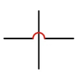

# Intersector for FigJam

Intersector is a FigJam widget inspired by the Hopper plugin for Figma. Instead of drawing a simple cross when two lines intersect, Intersector creates a clean arc to help visualize connections between lines in your FigJam files.

## Installation

1. Install [Node.js](https://nodejs.org/en/download/) which includes npm.
2. Run `npm install` to install development dependencies.
3. Build the widget with `npm run build`.
4. In FigJam, choose **Import widget from manifest** and select `manifest.json` from this repository.

## Usage

1. Select two straight lines in your FigJam file.
2. Run **Intersector** from the widgets menu.
3. The widget replaces the default intersection with an arc connecting the lines.

## Development

- `npm run watch` – rebuilds automatically when source files change.
- Source code lives in `widget-src/` and compiles to `dist/code.js`.
- After each build, reload the widget in FigJam to see changes.

## License

This project is released under the MIT License. See [LICENSE](LICENSE) for details.
